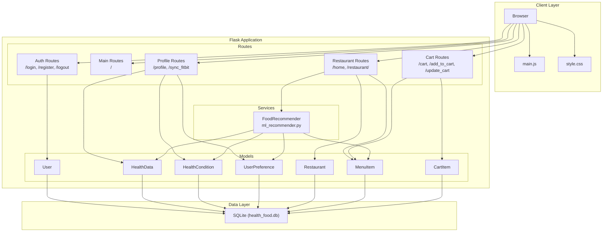
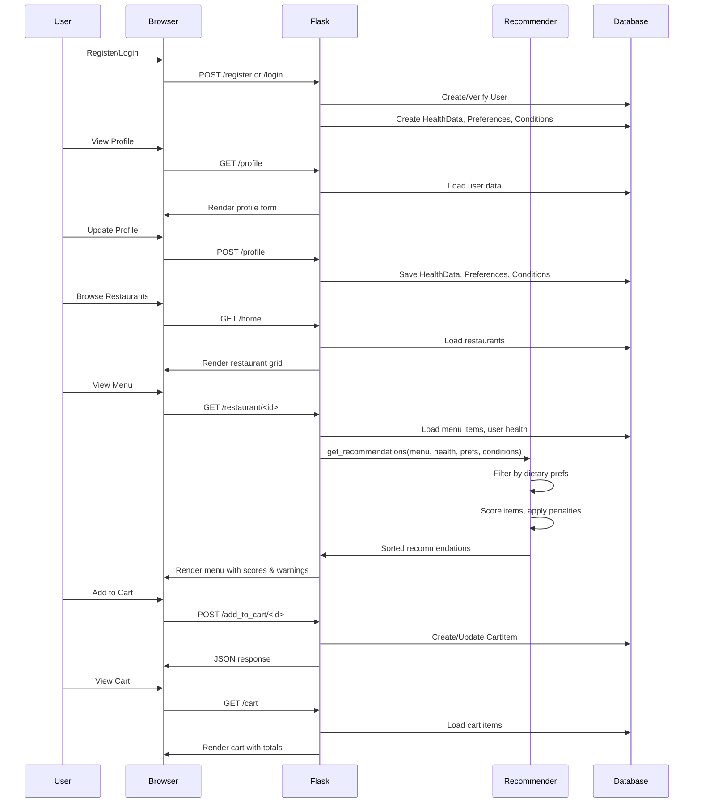

# Architecture

## Overview

NutriMatch is a Flask-based web application that provides personalized meal recommendations based on user health data, dietary preferences, and medical conditions. It features a curated catalog of South Indian restaurants with detailed nutritional information for each menu item.

## Architecture Diagram



## Data Flow Diagram



## Project Structure

```
smart-food/
├── app.py                 # Main Flask application, routes, DB init
├── config.py              # Configuration (env-based)
├── models.py              # SQLAlchemy models
├── ml_recommender.py      # Food recommendation engine
├── migrate_db.py          # Database migration helper
├── requirements.txt
├── ARCHITECTURE.md
├── README.md
├── .gitignore
├── instance/              # Flask instance folder
│   └── health_food.db    # SQLite database
├── templates/             # Jinja2 HTML templates
│   ├── index.html
│   ├── login.html
│   ├── register.html
│   ├── home.html
│   ├── restaurants.html
│   ├── menu.html
│   ├── profile.html
│   ├── cart.html
│   └── navbar.html
└── static/
    ├── css/
    │   └── style.css
    └── js/
        └── main.js
```

## Technology Stack

| Layer | Technology |
|-------|------------|
| Backend | Python 3, Flask |
| Database | SQLite, SQLAlchemy |
| Auth | Flask-Login, Flask-Bcrypt |
| Frontend | Jinja2, Vanilla JS, CSS |
| ML/Logic | Custom FoodRecommender |

## Key Components

### FoodRecommender

- **calculate_bmi()**: Computes BMI from weight (kg) and height (cm)
- **calculate_daily_needs()**: Harris-Benedict BMR + activity factor from steps
- **check_dietary_preferences()**: Strict filters for vegetarian, vegan, gluten-free, allergies
- **check_health_conditions()**: Condition-specific penalties (diabetes, hypertension, cholesterol, etc.)
- **get_recommendations()**: Scores items 0–100, returns ranked list with warnings and `is_safe` flag

### Models

| Model | Purpose |
|-------|---------|
| User | Auth, Fitbit tokens |
| HealthData | Weight, height, age, steps, vitals, targets |
| HealthCondition | Diabetes, hypertension, cholesterol, etc. |
| UserPreference | Dietary prefs, allergies, cuisines |
| Restaurant | Name, cuisine, rating, description |
| MenuItem | Nutrition, health tags, price |
| CartItem | User, menu item, quantity |

## Routes Summary

| Route | Methods | Auth | Description |
|-------|---------|------|-------------|
| / | GET | No | Landing page |
| /register | GET, POST | No | Registration |
| /login | GET, POST | No | Login |
| /logout | GET | Yes | Logout |
| /home | GET | Yes | Restaurant listing |
| /restaurant/<id> | GET | Yes | Menu with recommendations |
| /profile | GET, POST | Yes | Health profile form |
| /cart | GET | Yes | Cart view |
| /add_to_cart/<id> | POST | Yes | Add item (JSON) |
| /update_cart/<id> | POST | Yes | Update quantity (JSON) |
| /remove_from_cart/<id> | POST | Yes | Remove item (JSON) |
| /sync_fitbit | GET | Yes | Fitbit sync (placeholder) |

